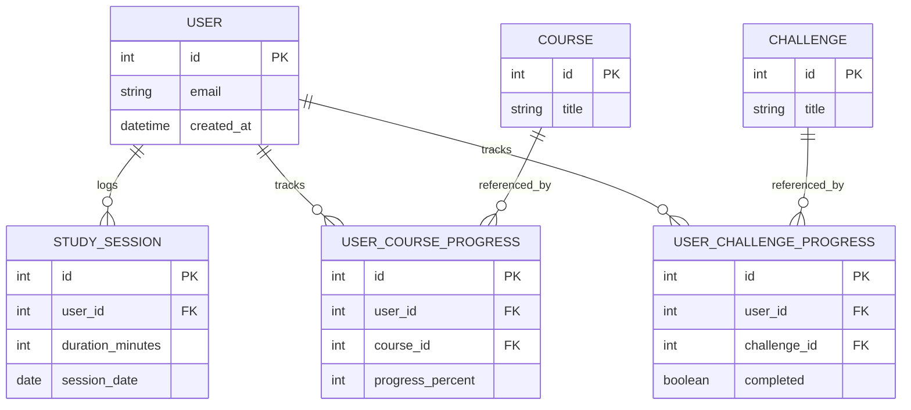

# SkillSync

SkillSync is a full-stack study-tracking platform designed to measure learning progress, visualize productivity trends, and help users build consistent study habits.  
It follows a modern architecture built on **Laravel 12 (API)**, **Vue 3 (SPA)**, and a **Docker-based infrastructure** mirroring production environments.

---

## 1. Overview

SkillSync provides:

- A secure API for authentication and study-session analytics  
- A responsive SPA dashboard for daily and weekly insights  
- A production-like Docker environment (Nginx, PHP-FPM, MySQL)

This project demonstrates strong fundamentals in **API design**, **modular service architecture**, **stateful SPA authentication**, and **frontend data visualization**.

---

## 2. Tech Stack

### Backend (API)
- PHP 8.3
- Laravel 12 (Sanctum auth, Eloquent ORM)
- MySQL 8
- API-first service layer

### Frontend (SPA)
- Vue 3 (Composition API)
- Vite
- Axios
- Chart.js

### Infrastructure
- Docker & Docker Compose
- Nginx
- PHP-FPM
- phpMyAdmin

---

## 3. Features

### Authentication
- Sanctum stateful SPA login
- CSRF-protected flows via `/sanctum/csrf-cookie`
- Secure session-based API access

### Dashboard
- Weekly bar-chart of study hours (Mon → Sun)
- Daily KPIs:
  - Courses in progress
  - Completed courses
  - Completed challenges
  - Time-spent today (H/M)
- Recent Courses (latest 3 with fallback image)

### Domain Model
Includes:
- Users  
- Courses  
- Challenges  
- StudySessions  
- UserCourseProgress  
- UserChallengeProgress

All modeled cleanly through Eloquent.



---

## 4. Project Structure
```text
SkillSync/

# Backend — Laravel API
├── api/
│   ├── app/
│   ├── database/
│   └── routes/

# Frontend — Vue 3 SPA
├── web/
│   ├── src/api/
│   ├── src/components/
│   └── src/pages/

# Docker Infrastructure
└── infra/
    ├── nginx/
    ├── php/
    ├── mysql/
    └── compose.yml
```

---

## 5. Local Development Setup

### Start the Docker environment

```bash
cd infra
docker compose up -d
```

Service | URL
--- | ---
Laravel API | http://localhost:8080
phpMyAdmin | http://localhost:8081
Vue SPA | http://localhost:5173

### Laravel Setup (First Run)

```bash
cd infra
docker compose up -d
docker compose exec php composer install
cp ../api/.env.example ../api/.env
docker compose exec php php artisan key:generate
docker compose exec php php artisan migrate --seed
```

Ensure the API `.env` contains:

```bash
APP_URL=http://localhost:8080
FRONTEND_URL=http://localhost:5173
SANCTUM_STATEFUL_DOMAINS=localhost:5173
SESSION_DOMAIN=localhost
DB_HOST=db
DB_DATABASE=skillsync
DB_USERNAME=skillsync
DB_PASSWORD=skillsync
```

If you edit `.env` after containers are running:

```bash
docker compose exec php php artisan config:clear
```

### Frontend Setup

```bash
cd web
cp .env.example .env
npm install
npm run dev
```

Ensure the SPA .env contains:
```bash
VITE_API_BASE_URL=http://localhost:8080
```

---

## 6. Deployment Overview

1. Build the frontend (`npm run build`)
2. Deploy the compiled `web/dist` to Nginx or any static host
3. Deploy `api/` to a production PHP-FPM environment
4. Set production `.env` values
5. Run migrations: `php artisan migrate --force`

---

## 7. Troubleshooting

### CSRF/Login issues

- Check Laravel `.env`:
  - `SESSION_DOMAIN=localhost`
  - `SANCTUM_STATEFUL_DOMAINS=localhost:5173`
  - `APP_URL=http://localhost:8080`
- Reset caches:
  - `docker compose exec php php artisan config:clear`
  - `docker compose exec php php artisan cache:clear`
  - `docker compose exec php php artisan route:clear`

---

## 8. Roadmap

### In Progress
- UI polishing
- Course/challenge CRUD

### Upcoming
- GitHub Actions CI (Pint, PHPStan, ESLint, Prettier)
- Production Docker build
- Full UX enhancements and analytics

---

## 9. Screenshots


Images:
- `/screenshots/dashboard.png` – main dashboard with chart + KPIs
- `/screenshots/login.png` – login screen
- `/screenshots/recent-courses.png` – recent courses UI
- `/screenshots/api-architecture.png` – optional architecture diagram


---

## 10. License

MIT
